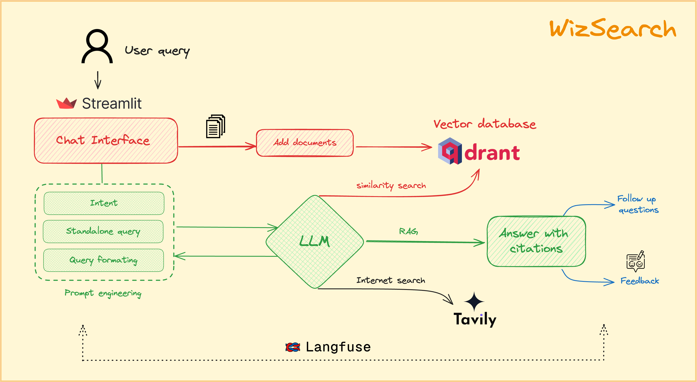

# WizSearch 🌟
Your intelligent ally for effortless data retrieval across documents and seamless browsing the web.

- **Ollama** : Connects to large language models via the Ollama server 
[🔗 Demo](https://wizsearch.streamlit.app/) |
[💻 Code](https://github.com/SSK-14/WizSearch/tree/main) 
- **Replicate** : Leverages the Replicate platform to integrate models
[🔗 Demo](https://wizsearch-replicate.streamlit.app/) |
[💻 Code](https://github.com/SSK-14/WizSearch/tree/replicate) 
- **OpenAI** : Utilizes OpenAI's API for advanced language model capabilities.
[🔗 Demo](https://wizsearch-openai.streamlit.app/) |
[💻 Code](https://github.com/SSK-14/WizSearch/tree/openai) 

## How we built it 🛠️
We built Wiz Search using the following components:
- **LLM:** Open source models like llama3, mistral, gemma, etc using [Ollama](https://ollama.ai/) for natural language understanding and generation.
- **Embeddings:** [BAAI/bge-small-en-v1.5](https://huggingface.co/BAAI/bge-small-en-v1.5) to enhance search relevance.
- **Intelligent Search:** [Tavily](https://tavily.com/) for advanced search capabilities.
- **Vector Databases:** [Qdrant](https://qdrant.tech/) for efficient data storage and retrieval.
- **Observability:** [Langfuse](https://www.langfuse.com/) for monitoring and observability.
- **UI:** [Streamlit](https://streamlit.io/) for creating an interactive and user-friendly interface.



## Run The Application ⚙️
1. Clone the repo
```
git clone https://github.com/SSK-14/WizSearch.git
```

2. Install required libraries

- Create virtual environment
```
pip3 install virtualenv
python3 -m venv {your-venvname}
source {your-venvname}/bin/activate
```

- Install required libraries
```
pip3 install -r requirements.txt
```

- Activate your virtual environment
```
source {your-venvname}/bin/activate
```

3. Set up your `secrets.toml` file
- Copy `example.secrets.toml` into `secrets.toml` and replace the keys

4. Running
```
streamlit run app.py 
```

## Contributing 🤝
Contributions to this project are welcome! If you find any issues or have suggestions for improvement, please open an issue or submit a pull request on the project's GitHub repository.

## License 📝
This project is licensed under the [MIT License](https://github.com/SSK-14/WizSearch/blob/main/LICENSE). Feel free to use, modify, and distribute the code as per the terms of the license.

