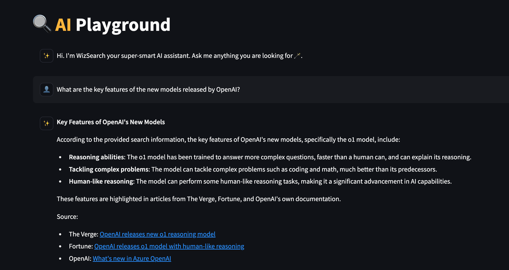
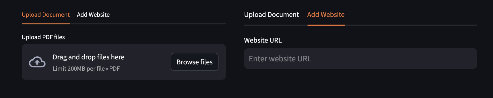
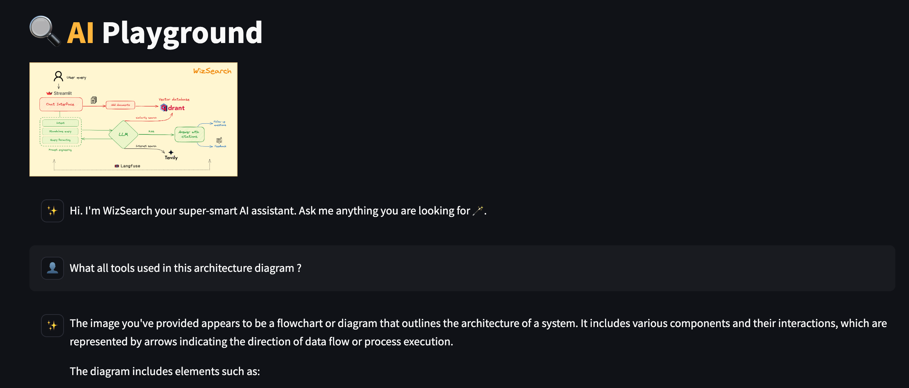
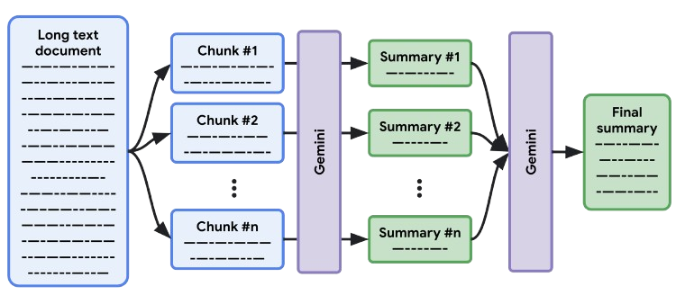

# ⭐ WizSearch Features

## 🔍 1. AI-Powered Internet Search
WizSearch leverages state-of-the-art large language models (LLMs) to perform highly accurate and relevant searches. By creating smart queries, it scours the internet and delivers concise, informative answers based on real-time data, ensuring you get the best search results every time!

## 📚 2. Add Your Own Knowledge Base
Easily expand your knowledge base by uploading documents or adding website URLs. WizSearch intelligently scrapes the content, allowing you to search across these sources for quick answers to your questions. Plus, you can store this data in a database for easy retrieval whenever needed!

## 🖼️ 3. Understand Images with AI
WizSearch isn’t just limited to text! It incorporates vision models that analyze and understand images. Whether from search results or images you upload, you can ask questions about the content of the images and get detailed, intelligent responses.

## ✨ 4. Summarization & Key Points Extraction
For any document or website you upload, WizSearch uses advanced map-reduce techniques with LLMs to summarize content and extract key points. This gives you a quick overview or a detailed breakdown, saving you time and effort!

